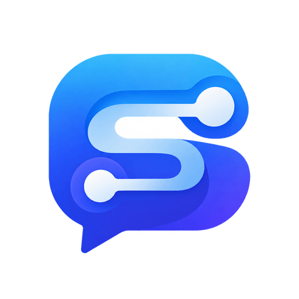
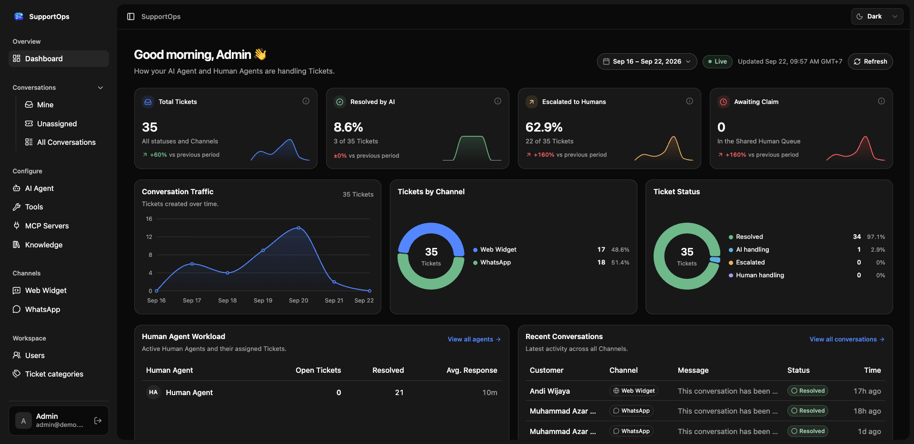
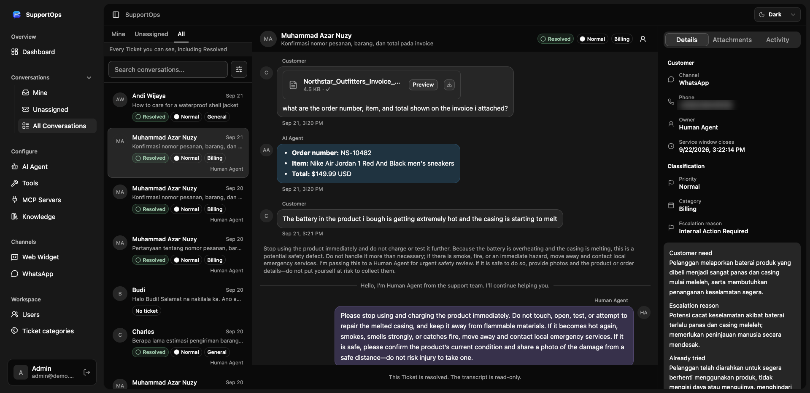
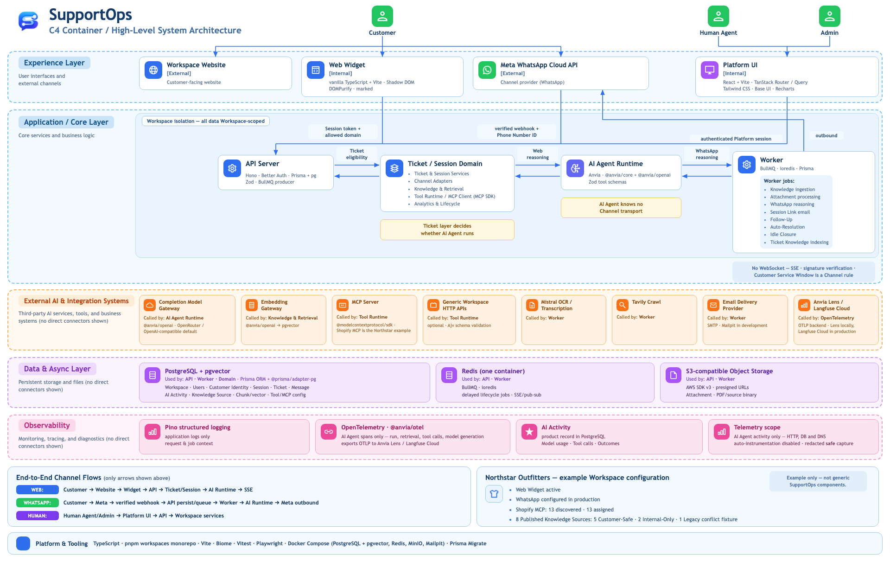

<p align="center">
  
</p>

<h1 align="center">SupportOps</h1>

<p align="center">
  An AI-first, multi-tenant customer support platform.<br />
  An AI Agent answers every conversation first and hands off to a Human Agent when it cannot safely resolve it.
</p>

<p align="center">
  <a href="https://github.com/azarnuzy/supports-ops/actions/workflows/ci-cd.yml"></a>
  <a href="LICENSE"></a>
  
  
</p>



## Features

- **AI Agent first, humans when it matters** — the AI Agent answers from your Knowledge Sources and Tools, and escalates to the Shared Human Queue with a handoff summary (customer need, escalation reason, what was already tried) when it cannot resolve a conversation safely.
- **Human Agent inbox** — Mine / Unassigned / All views, claim-and-reply, Ticket priority and category, attachments, and a full activity trail.
- **Multiple Channels, one support logic** — a drop-in Web Widget (vanilla JS, Shadow DOM) and WhatsApp through the Meta Cloud API. Channel Adapters keep transport separate from reasoning, so new Channels don't touch support logic.
- **Knowledge** — PDFs (with OCR), crawled documentation, and text, embedded into pgvector. Each source is either Customer-Safe or Internal-Only.
- **Tools and MCP servers** — give the AI Agent HTTP Tools or tools discovered from MCP servers, each reviewed and assigned per Workspace.
- **Multi-tenant by construction** — every row belongs to one Workspace, enforced by a Prisma extension rather than by convention.
- **Measurable AI** — OpenTelemetry spans for agent, model, retrieval, and Tool calls, a manual eval suite, and a Session cost profiler.



## Architecture



The domain language (Workspace, Session, Ticket, Knowledge Source, Channel, ...) is defined in [`CONTEXT.md`](CONTEXT.md), and the reasoning behind the main decisions lives in [`docs/adr/`](docs/adr/).

### Tech stack

| Layer | Choice |
| --- | --- |
| API | Node.js, [Hono](https://hono.dev), [Better Auth](https://better-auth.com), Prisma |
| Frontend | React, Vite, TanStack Router + Query, Tailwind, shadcn/ui |
| Web Widget | Vanilla TypeScript in a Shadow DOM |
| Data | PostgreSQL + pgvector, Redis + BullMQ |
| AI | OpenRouter (or any OpenAI-compatible gateway), MCP |
| Observability | Pino, OpenTelemetry (OTLP) |
| Tooling | pnpm workspaces, Biome, Vitest, Playwright |

## Project structure

```text
apps/
  api/              Hono API on Node.js
  business-system/  separate, read-only Customer, Subscription, and Invoice HTTP service
  platform/         Admin and Human Agent app (React + Vite + TanStack Router + TanStack Query)
  widget/           customer-facing Web Widget
  worker/           Redis + BullMQ deployable
packages/
  ai-agent/         AI Agent reasoning boundary
  api-client/       typed Hono RPC client shared by the frontend apps
  channels/         Channel Adapter boundary
  knowledge/        Knowledge retrieval boundary
  logger/           Pino logging and OpenTelemetry setup for server applications
  shared/           schemas shared across application boundaries
  storage/          S3-compatible object storage primitives
  test-db/          throwaway, migrated Postgres databases for *.db.test.ts suites
  tools/            Business Tool boundary
  ui/               shared shadcn components
```

Packages are source-only: they export their `.ts`/`.tsx` files directly and do not have a build step.
Runtime-specific environment validation lives with the API and worker that consume it.

## Getting started

### Prerequisites

- Node.js 22+ and pnpm 10 (`corepack enable`)
- Docker (for Postgres and Redis)
- An [OpenRouter](https://openrouter.ai) API key — see [AI credentials](docs/setup/03-ai-credentials.md)

### Run locally

```sh
pnpm install
cp .env.example .env.local        # set OPENROUTER_API_KEY and BETTER_AUTH_SECRET at minimum
docker compose -f docker-compose.dev.yaml up -d
pnpm db:generate
pnpm db:migrate
pnpm seed:demo                    # demo Workspace; prints Admin and Human Agent logins
pnpm dev                          # every app in parallel
```

Or run apps one at a time:

```sh
pnpm --filter @repo/api dev              # http://localhost:8000
pnpm --filter @repo/business-system dev  # http://localhost:8001
pnpm --filter @repo/platform dev         # http://localhost:3000
pnpm --filter @repo/widget dev           # http://localhost:3002
pnpm --filter @repo/worker dev
```

Knowledge ingestion, object storage, email, telemetry, and WhatsApp each need their own credentials. [`docs/setup/`](docs/setup/00-overview.md) walks through them in order.

### Useful scripts

| Command | What it does |
| --- | --- |
| `pnpm test` | Vitest suites across the workspace |
| `pnpm typecheck` | TypeScript in every package |
| `pnpm check` / `pnpm check:fix` | Biome lint + format |
| `pnpm createsuperuser` | Create or promote an admin user |
| `pnpm eval:ai-agent` | Run the AI Agent eval suite |
| `pnpm db:studio` | Open Prisma Studio |

## Tests

```sh
pnpm test
```

This runs the base Vitest suites for API, Platform, and Worker.

### Database-backed tests

Tests named `*.db.test.ts` run against a real, migrated Postgres instead of a
mocked Prisma client. They need nothing beyond the development database:

```sh
docker compose -f docker-compose.dev.yaml up -d postgres
pnpm test
```

`createTestDatabase()` from `@repo/test-db` creates a randomly named database on
that server, applies `prisma migrate deploy` to it, and hands back a connection
string; `drop()` removes it afterwards. Names are random, so API and Worker
suites can run in parallel. Point `TEST_DATABASE_URL` at another server to use
one instead of the compose Postgres.

See `apps/api/src/modules/registration/services.db.test.ts` for the shape.

For a manual end-to-end run through the Web Widget, AI Agent, Human Agent,
Langfuse telemetry, and the AI eval matrix, see the
[local end-to-end runbook](docs/testing/e2e-runbook.md).

## Auth and API Client

The API uses Better Auth for email/password auth, session cookies, and admin roles. Better Auth is mounted at `/api/auth/*`; custom API routes use Hono RPC types through `packages/api-client`.

Frontend apps should use:

- Better Auth client methods for sign-in, sign-up, and sign-out.
- `createApiClient()` from `@repo/api-client` for typed API routes such as `/session` and `/users`.

Configure auth with `BETTER_AUTH_SECRET`, `BETTER_AUTH_URL`, and `CLIENT_ORIGINS` in `.env.local` for development or `.env` for root Docker Compose production.
Use a unique `BETTER_AUTH_SECRET`; production environments reject the default value and secrets
shorter than 32 characters.

Create or promote an admin user:

```sh
pnpm createsuperuser
```

## Storage

`packages/storage` exports S3-compatible helpers for AWS S3, MinIO, Cloudflare R2, DigitalOcean Spaces, and similar providers.

```ts
import { createStorage } from "@repo/storage";

const storage = createStorage({
  accessKeyId: "access-key",
  bucket: "uploads",
  forcePathStyle: false,
  region: "ap-southeast-1",
  secretAccessKey: "secret-key",
});

await storage.putObject({
  key: "uploads/example.txt",
  body: "hello",
  contentType: "text/plain",
});
```

Configure it with `S3_BUCKET`, `S3_REGION`, `S3_ACCESS_KEY_ID`, `S3_SECRET_ACCESS_KEY`, and optional endpoint/path-style/public URL variables in `.env.local` for development or `.env` for root Docker Compose production.

## Logging

`packages/logger` exports Pino helpers for structured JSON logs.

```ts
import { createLogger } from "@repo/logger";
import { loggerConfig } from "./config";

const logger = createLogger({
  ...loggerConfig,
  service: "api",
});

logger.info({ userId: "user_123" }, "User signed in");
```

Trace-aware helpers use OpenTelemetry-compatible `trace_id`, `span_id`, and `trace_flags` fields. When telemetry is enabled, active span context is attached to Pino logs automatically.

## Telemetry

`packages/logger/telemetry` starts the OpenTelemetry Node SDK before API and worker modules load. Only explicit AI Agent, model, retrieval, and Tool spans are exported; infrastructure libraries are not auto-instrumented.

Telemetry is disabled by default. For local span output:

```sh
ENABLE_TELEMETRY=true
TELEMETRY_EXPORTER=console
```

For an OTLP HTTP collector:

```sh
ENABLE_TELEMETRY=true
TELEMETRY_EXPORTER=otlp
TELEMETRY_EXPORTER_OTLP_ENDPOINT="https://collector.example.com/v1/traces"
TELEMETRY_API_KEY="..."
TELEMETRY_API_KEY_HEADER="authorization"
```

If `TELEMETRY_API_KEY_HEADER` is `authorization`, the exporter sends `Authorization: Bearer <key>`. Other header names send the raw key value, which fits providers that expect headers such as `x-honeycomb-team`.

## AI Agent Evals

`apps/api/src/evals` runs Eval Cases against the live Workspace named by `EVAL_WORKSPACE_ID` — its published Knowledge Sources, its AI Agent instructions, and its assigned Tools — to judge whether a change to the AI Agent made things better or worse. Run by hand, not in CI (ADR-0010):

```sh
pnpm eval:ai-agent                                 # every suite
pnpm eval:ai-agent faithfulness                    # one metric suite
pnpm eval:ai-agent staleness                       # one Case category
pnpm eval:ai-agent --id=staleness-conflicting-return-window
```

Suites are per metric: `contains`, `exactmatch`, `relevancy`, `faithfulness`, `geval`, `decision`, `tool`, `visibility`, `language`, `retriever`, `retrieval`, and `negativecontrol`. Cases carry a category (`abstention`, `attachment`, `common`, `edge`, `escalation`, `guardrail`, `language`, `staleness`, `toolCall`, `visibility`) that can be used as a filter. `negativecontrol` is a canary wired to always fail, so a broken evaluator can't quietly mark everything as passing. Results print to the console and report through the OTel eval reporter alongside agent telemetry.

Needs `EVAL_WORKSPACE_ID` plus `COMPLETION_GATEWAY_API_KEY` (or `OPENROUTER_API_KEY`). Case inventory and failure triage: [`docs/testing/ai-agent-eval-cases.md`](docs/testing/ai-agent-eval-cases.md).

## Session Cost

`pnpm cost:measure` (`scripts/cost-measure.ts`) drives scripted Sessions through the real Web Widget HTTP API against `EVAL_WORKSPACE_ID` — API server and attachment/Ticket Knowledge workers in-process — and taps `fetch` to record every provider call's reported usage, plus one Knowledge ingestion run in a throwaway Workspace. It writes a token profile (no prices) to `docs/research/cost-runs/` and resumes an unfinished profile on a re-run:

```sh
pnpm cost:measure                  # all scripts ×3 + ingest
pnpm cost:measure faq-short ingest # a subset
COST_RUNS=1 pnpm cost:measure      # fewer runs
```

Stop the dev worker first, or it consumes this run's jobs outside the tap.

## Model and Gateway Configuration

Completions go through OpenRouter by default. Point them at another OpenAI-compatible gateway with `COMPLETION_GATEWAY_BASE_URL` and `COMPLETION_GATEWAY_API_KEY`; leave both empty to keep using `OPENROUTER_API_KEY`. `EMBEDDING_MODEL` and `LLM_MODEL_FAST` are set in the environment; `LLM_MAIN_REASONING_EFFORT` and `LLM_MAIN_MAX_OUTPUT_TOKENS` tune the reply model and may be left empty to use provider defaults. The reply model itself is each AI Agent's Agent Model, chosen from the code-defined Model Catalog — see `.env.example` and [`docs/setup/03-ai-credentials.md`](docs/setup/03-ai-credentials.md).

## Docker

```sh
cp .env.example .env
# Set BETTER_AUTH_SECRET in .env, for example:
openssl rand -base64 32
docker compose up --build
```

The production Compose file builds only the API application and its Postgres database. The API is available at `http://localhost:8000` by default; override `API_HOST_PORT` when another host port is required.

The API container runs Prisma migrations with `pnpm db:deploy` on startup. If you already created a local Compose database with the older `db:push` flow, reset the local volume or baseline the database before switching to migrations.

For local development, `docker-compose.dev.yaml` still provides Postgres and Redis while the API, worker, and frontends run directly through pnpm:

- API health: `http://localhost:8000/health`
- Postgres with `docker-compose.dev.yaml`: `localhost:15432`
- Redis with `docker-compose.dev.yaml`: `localhost:16379`

## Contributing

Issues and pull requests are welcome.

1. Read [`CONTEXT.md`](CONTEXT.md) — the codebase uses its terms (for example, never plain "Agent"; say AI Agent or Human Agent).
2. Follow the conventions in [`docs/conventions.md`](docs/conventions.md) and check whether an [ADR](docs/adr/) already covers your change.
3. Before opening a PR, make sure `pnpm check`, `pnpm typecheck`, and `pnpm test` pass.
4. Use [Conventional Commits](https://www.conventionalcommits.org) (`feat(api): ...`, `fix(widget): ...`).

## License

[MIT](LICENSE)
