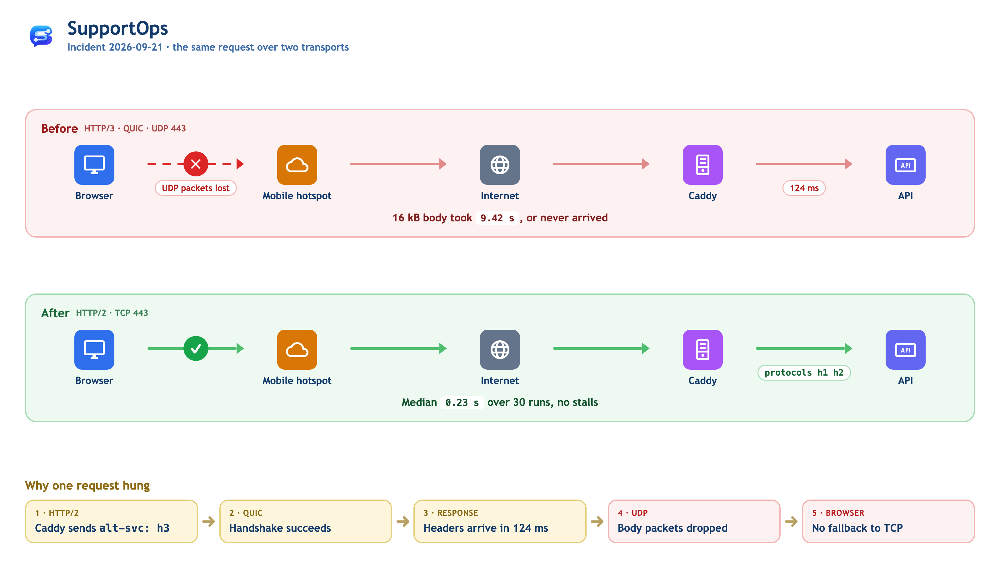
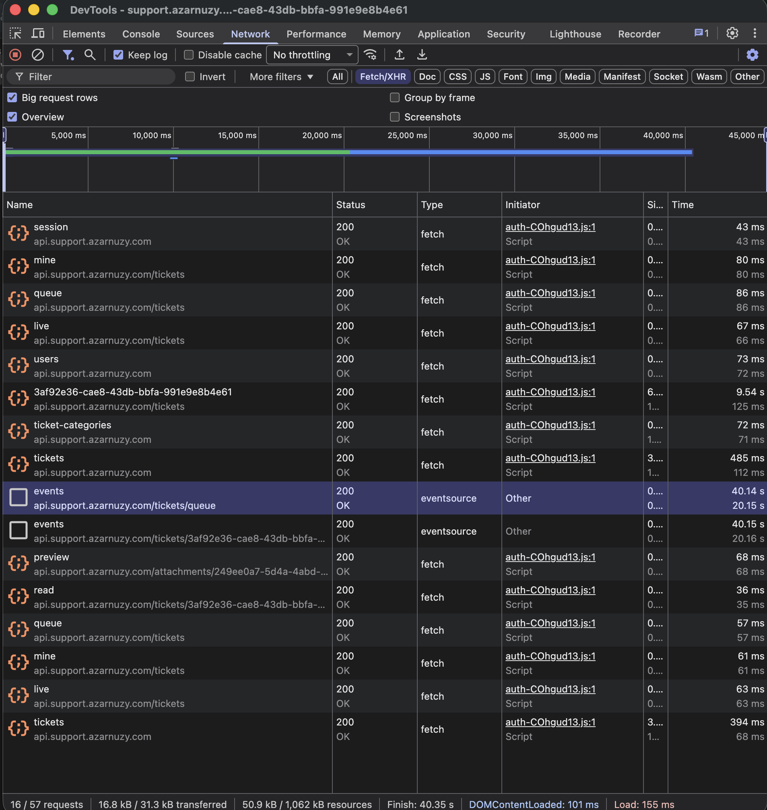
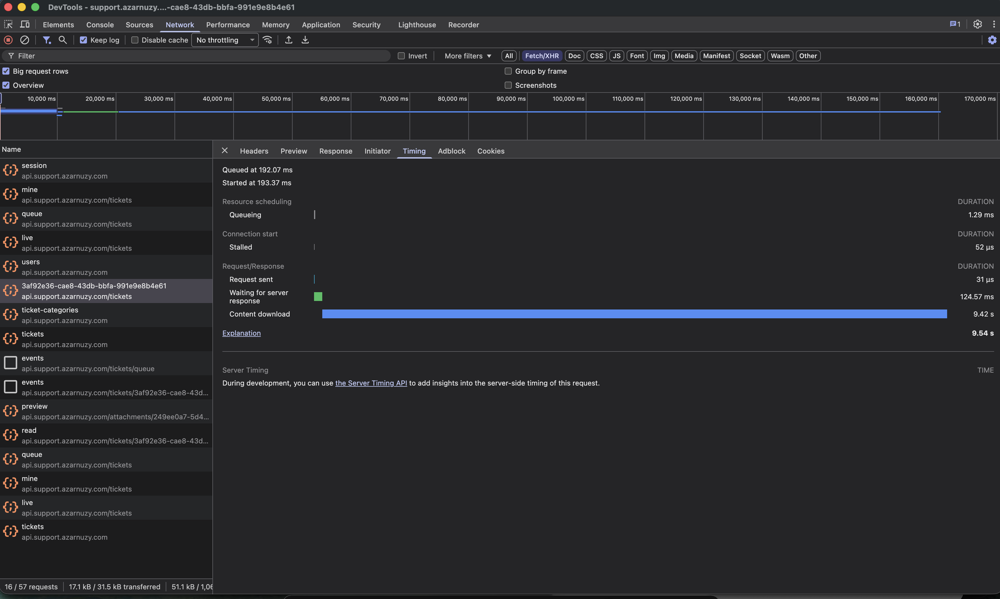
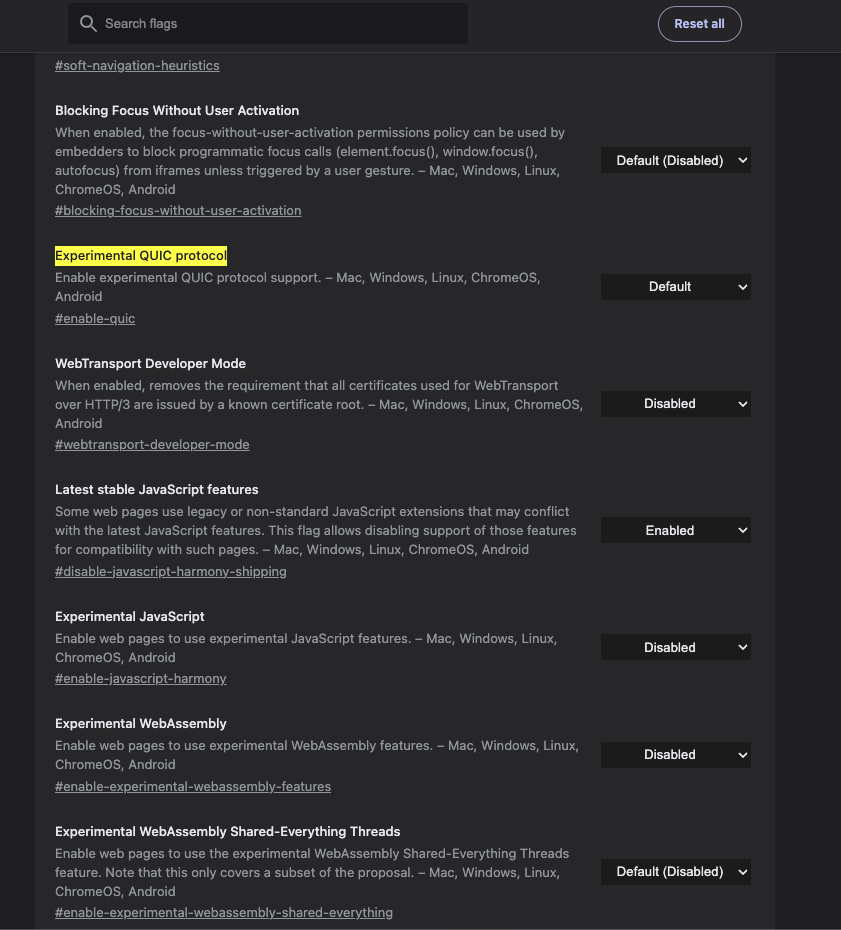

# Fast Server, Slow Pages: How HTTP/3 Tripped Us Up

*21 September 2026 · a SupportOps debugging write-up*

**English** · [Bahasa Indonesia](README.id.md)



---

## It started with one slow Ticket

That afternoon I opened the SupportOps Inbox and clicked on a resolved Ticket. It took about ten seconds to load. Another Ticket opened instantly. Then I tried the home page, `support.azarnuzy.com`, and got a blank white screen with a spinner that never stopped.

Bugs that are "sometimes fast, sometimes slow" are hard to track down, because the cause could be almost anywhere. My first guess was the obvious one: the server was slow. Maybe a heavy query, maybe the VPS was running out of memory, maybe it needed caching.

None of that turned out to be true. The server was fine the whole time. The problem was the **transport the browser used to connect to the server**. This post walks through how I got there.

## First observation: small responses were fast, large ones were slow

I opened DevTools, went to the Network tab, filtered by Fetch/XHR, and opened the Ticket again.



Almost every request finished in 36–86 ms, except one: the Ticket detail request, which took **9.54 s**. Looking closer, the larger the response, the longer it took:

| Request | Size | Time |
|---|---|---|
| `session`, `users`, `read` | < 1 kB | 36–80 ms |
| `tickets` (list) | ~3 kB | 394–485 ms |
| `tickets/:id` (detail) | ~16 kB | **9.54 s** |

The server does about the same amount of work for each of these. What differs is the number of **packets** each response needs. A 16 kB response is split into roughly twelve packets of 1.2–1.5 kB. If even one of them is lost, the whole response has to wait for it to be resent.

## The server had already responded in 124 ms

I clicked on the slow request and opened the Timing tab.



- **Waiting for server response (TTFB): 124.57 ms**
- **Content download: 9.42 s**

This is the most important screenshot here. TTFB shows how long the server spent processing the request: queries, the handler, business logic. Content download shows how long it took for the data to reach the browser. The API was done in 124 ms. The remaining 9.4 seconds were spent just getting 16 kB from the proxy to my laptop.

So the database and the application code weren't the cause. The problem was somewhere on the path between the server and the laptop.

## Checking the other possibilities

I looked at the VPS monitoring for the hour of the incident. The server was barely doing anything: CPU averaged **7.7%** (peak 13.9%), memory was at **40%**, disk utilisation was **0.02%**, and there were only 3 TCP connections on average. A 2-vCPU VPS at 8% CPU doesn't need nine seconds to send 16 kB.

Then I tested with `curl` from the same laptop on the same network:

| Test | Result |
|---|---|
| `GET /` (HTML shell), 3 runs | 0.18–0.23 s |
| `GET /assets/index-*.js` (253 kB), **30 runs** | **median 0.23 s**, slowest 0.53 s |
| ICMP ping × 20 to the VPS | **0% loss**, 47 ms RTT |

`curl` was fast on all 30 runs, while the browser on the same laptop kept stalling. Same laptop, same network, same server. So what was different between `curl` and the browser?

The answer was in the response headers:

```
alt-svc: h3=":443"; ma=2592000
```

## Some background: what is `alt-svc`?

To make sense of this header, it helps to know a bit about how HTTP gets from one machine to another.

**TCP and UDP.** Nearly all internet traffic runs on one of these two protocols. **TCP** is like sending a parcel with tracking: there's a handshake up front, every packet is acknowledged, and lost packets are resent automatically by the operating system. **UDP** is much simpler: each packet (a *datagram*) is sent without any check that it arrived. Routers, NATs and firewalls have handled TCP well for decades. UDP, on the other hand, is often rate-limited, given lower priority, or blocked entirely.

**HTTP/2 and HTTP/3.** HTTP/2 (2015) runs over TCP and lets many requests share a single connection (*multiplexing*). HTTP/3 (2022, [RFC 9114](https://www.rfc-editor.org/rfc/rfc9114)) runs over **QUIC**, and QUIC runs over **UDP**. QUIC adds the features you'd normally get from TCP (retransmission, ordering, congestion control, TLS 1.3) on top of UDP. On networks that don't restrict UDP, it works well. The catch is that, as far as the network is concerned, QUIC traffic is **just UDP traffic**.

**Alt-Svc.** A browser never starts with HTTP/3. The first connection always goes over TCP, and the server then tells the browser that it also supports HTTP/3 on UDP port 443. The browser remembers this for 30 days. That's what `alt-svc: h3=":443"; ma=2592000` means ([RFC 7838](https://www.rfc-editor.org/rfc/rfc7838)). From then on, the browser switches to QUIC.

Worth noting: I never enabled HTTP/3. **Caddy turns it on by default**, because the default value of its `protocols` option is `h1 h2 h3` ([docs](https://caddyserver.com/docs/caddyfile/options)). HTTP/3 had been active since the very first deploy.

Now things started to add up. `curl` was using **HTTP/2 over TCP**, while the browser had received `alt-svc` and was using **HTTP/3 over QUIC (UDP)**. And I was on a **phone hotspot** at the time.

## The test that confirmed it

To be sure, I needed to test this. I opened `brave://flags/#enable-quic` and set **Experimental QUIC protocol** to *Disabled*.



I didn't change anything else: same server, same network, same pages. The app became **really smooth**. Every Ticket opened right away.

This A/B test was the key piece of evidence. The earlier steps narrowed things down; this one confirmed the cause.

## Why UDP struggles on a phone hotspot

Mobile networks are known to be unfriendly to UDP, for three main reasons:

- **Short-lived NAT bindings.** On mobile networks, one public IP is shared by thousands of subscribers through **CGNAT** (Carrier-Grade NAT). A TCP connection has a clear start and end, so the NAT can track it easily. UDP has no such markers, so the NAT only keeps it around for a limited time. According to [RFC 9308 §3.2](https://www.rfc-editor.org/rfc/rfc9308#section-3.2), a UDP binding *"can expire after just thirty seconds of inactivity"*.
- **A smaller MTU.** Tethering and carrier tunnels reduce the maximum packet size (**MTU**). TCP adapts by sending smaller segments. QUIC can't, because its datagrams must be at least 1200 bytes ([RFC 9000 §14.1](https://www.rfc-editor.org/rfc/rfc9000#section-14.1)) and **must not** be fragmented ([§14.2](https://www.rfc-editor.org/rfc/rfc9000#section-14.2)). A packet that's too large is simply dropped, with no notice to either side.
- **UDP shaping.** RFC 9308 §2 notes that *"between 3% and 5% of networks block all UDP traffic"*. Other networks don't block UDP but slow it down, which is much harder to spot.

## The surprise: the browser doesn't fall back to TCP

It's easy to assume the browser will switch to TCP if QUIC fails. That's true, but only in certain cases. Ian Swett, a QUIC engineer on Chromium, [explains](https://groups.google.com/a/chromium.org/g/proto-quic/c/cWoQxBMopR0):

> If the handshake fails (i.e. UDP is blackholed), Chrome will mark QUIC as broken, then retry the request over TCP without the user having to reload. […] **If a request fails post handshake, there is no auto-retry.**

That's the explanation. If UDP is **completely** blocked, the handshake fails and the browser quietly moves to TCP, so users never notice. But if UDP is only **partly** broken, the small handshake packets still get through and the connection looks healthy. Then many of the larger packets carrying the response body get lost, and the request hangs.

Put in order, here's what happened:

1. Caddy sent `alt-svc: h3`, and the browser switched to QUIC.
2. The QUIC handshake succeeded.
3. The API responded in 124 ms, and the headers reached the browser.
4. Some of the full-size UDP packets carrying the body were lost on the hotspot path. QUIC resent them with growing delays (exponential back-off), so downloads took 9 seconds, or never finished at all.
5. Because the failure happened **after** the handshake, Chromium didn't retry over TCP. It kept trying HTTP/3 on later requests, which is why things were sometimes fast and sometimes slow.

**So the server was fast all along. The problem was the transport the browser picked, which wasn't reliable on that network.**

## Other people have hit this too

I searched Caddy's GitHub issues and found the same pattern in several of them:

- [#7556](https://github.com/caddyserver/caddy/issues/7556): occasional `ERR_QUIC_PROTOCOL_ERROR` in Chrome. One comment describes *"response headers flush, some body bytes arrive, then the stream aborts mid-body"*, which matches what I saw: fast headers, stalled body. Setting `QUIC_GO_DISABLE_GSO=true` reduced the number of aborts.
- [#5942](https://github.com/caddyserver/caddy/issues/5942): Firefox requests time out *"after several clicks all served successfully over HTTP/3"*.
- [#6537](https://github.com/caddyserver/caddy/issues/6537) (still open): *http3 breaks SSE*. Relevant because the SupportOps Inbox relies on SSE.
- [#7885](https://github.com/caddyserver/caddy/issues/7885): HTTP/3 over Tailscale fails because of MTU, a real-world case of the MTU problem above.
- [#5075](https://github.com/caddyserver/caddy/issues/5075): how to disable HTTP/3. The maintainer's answer is exactly the fix I used.

Most of these issues were closed without a definite root cause. That's because the cause is hard to reproduce: it lives in the network path, in the kernel's UDP offload (GSO), or in the QUIC library (quic-go). The usual recommendation is always the same: **disable HTTP/3 and stick with TCP.**

## The fix is three lines

The `protocols` option in Caddy is **global**, so it belongs in the global options block at the top of the main Caddyfile, not in a site block. Putting it in a site file gives you a syntax error.

```caddy
{
	email <admin email>
	servers {
		protocols h1 h2
	}
}

import /etc/caddy/apps/*.caddy
```

This applies to every site on that Caddy instance, which is what I wanted. Then validate and reload (no downtime):

```bash
docker exec caddy caddy validate --config /etc/caddy/Caddyfile
docker exec caddy caddy reload   --config /etc/caddy/Caddyfile
```

And check that none of the domains send the HTTP/3 header anymore:

```bash
for h in support api.support widget.support; do
  echo "$h: $(curl -sI https://$h.azarnuzy.com | grep -i alt-svc || echo 'no alt-svc')"
done
```

All three domains printed `no alt-svc`. Browsers that still have the old `alt-svc` cached may keep trying HTTP/3 for a while. To confirm the fix right away, restart the browser or open a private window.

## What do we lose without HTTP/3?

| HTTP/3 advantage | Impact on SupportOps |
|---|---|
| Faster connection setup (1 RTT instead of 2–3) | Saves about 50–100 ms at a 47 ms RTT, and only on **new** connections. The dashboard reuses the same connection. |
| No head-of-line blocking between streams | Noticeable with many parallel requests on a lossy network. Our pages only call a few small JSON endpoints. |
| Connection migration (Wi-Fi ↔ cellular) | Useful for phone users. Human Agents mostly work from laptops. |
| Better on poor mobile networks | In theory, yes. In practice, the mobile network was exactly where HTTP/3 broke. |

HTTP/2 over TCP isn't outdated. We still get TLS 1.3 and HTTP/2 multiplexing. The cost is at most about 100 ms when opening a new connection. What we gain is no more 9-second stalls that the browser can't recover from. That's clearly worth it.

If we ever want to turn HTTP/3 back on, the first thing to try is `QUIC_GO_DISABLE_GSO=true` on the Caddy container. Before that, we should have a way to monitor HTTP/3 performance across different client networks.

## What we still can't confirm

A few things can't be proven from the data I have:

- **Where exactly UDP was failing.** The A/B test proves QUIC was the cause, but it doesn't show whether the problem was the carrier's CGNAT, the hotspot's MTU, UDP shaping, or the quic-go/GSO behaviour from #7556. Finding out would take a packet capture or a `qlog`.
- **The protocol used by each slow request.** I didn't have the **Protocol** column enabled in DevTools during the incident, so I can't show directly that the 9.42 s request used `h3`. That conclusion rests on the A/B test.
- **Comparison with other networks.** I didn't get to compare with a home or office connection while HTTP/3 was still on. The fix doesn't depend on this, though, since no client uses UDP anymore.

## Lessons: how to debug a "slow page" report

Start at the lowest layer and work your way up. Each step takes under a minute.

1. **Check the Timing tab.** If *Waiting for server response* is high, the problem is server processing, so jump to step 6. If *Content download* is high while waiting is low, the problem is delivery, so move on to the next step.
2. **Enable the Protocol column** in DevTools → Network. If the slow requests use `h3`, suspect the transport first.
3. **Check whether the server advertises HTTP/3:** `curl -sI https://support.azarnuzy.com | grep -i alt-svc`.
4. **Compare with TCP.** Hit the same URL several times with `curl`. If `curl` is always fast but the browser isn't, the problem is below the HTTP layer.
5. **Run an A/B test.** Disable QUIC (`chrome://flags/#enable-quic` or `brave://flags/#enable-quic`), or try a different network. If the problem goes away, the transport is the cause.
6. **Check the server:** VPS monitoring, then the API logs and `docker logs caddy`.
7. **Only then profile the code:** queries, N+1, and payload size.

The biggest lesson for me: the DevTools timing panel made it look like the server was slow to send data. The natural reaction is to optimise the API, add caching, or upgrade the VPS. None of those would have fixed anything. **Find out where the time actually goes before you start fixing.**

---

## References

**Specifications**

- [RFC 9000: QUIC](https://www.rfc-editor.org/rfc/rfc9000): §14.1 (1200-byte minimum), §14.2 (no IP fragmentation)
- [RFC 9114: HTTP/3](https://www.rfc-editor.org/rfc/rfc9114): §3.1.1 (discovery through Alt-Svc)
- [RFC 9308: Applicability of QUIC](https://www.rfc-editor.org/rfc/rfc9308): §2 (3–5% of networks block UDP), §3.2 (30-second NAT bindings)
- [RFC 7838: HTTP Alternative Services](https://www.rfc-editor.org/rfc/rfc7838)

**Caddy and quic-go**

- [Caddy global options: `servers` → `protocols`](https://caddyserver.com/docs/caddyfile/options)
- Caddy issues: [#7556](https://github.com/caddyserver/caddy/issues/7556) · [#5942](https://github.com/caddyserver/caddy/issues/5942) · [#6678](https://github.com/caddyserver/caddy/issues/6678) · [#6537](https://github.com/caddyserver/caddy/issues/6537) · [#7885](https://github.com/caddyserver/caddy/issues/7885) · [#5075](https://github.com/caddyserver/caddy/issues/5075) · [#3833](https://github.com/caddyserver/caddy/issues/3833)
- [quic-go #4394: GSO severely degrades connection performance](https://github.com/quic-go/quic-go/issues/4394)

**Browser behaviour**

- [Chromium proto-quic: QUIC client timeouts and failover to h2](https://groups.google.com/a/chromium.org/g/proto-quic/c/cWoQxBMopR0)

*Diagram source: [`request-path.html`](request-path.html).*
