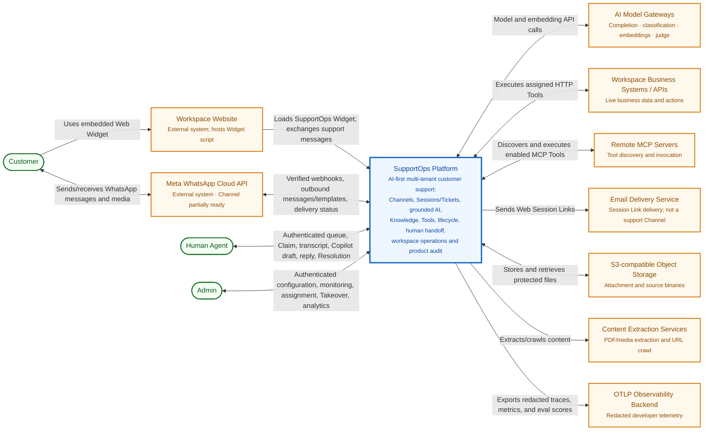
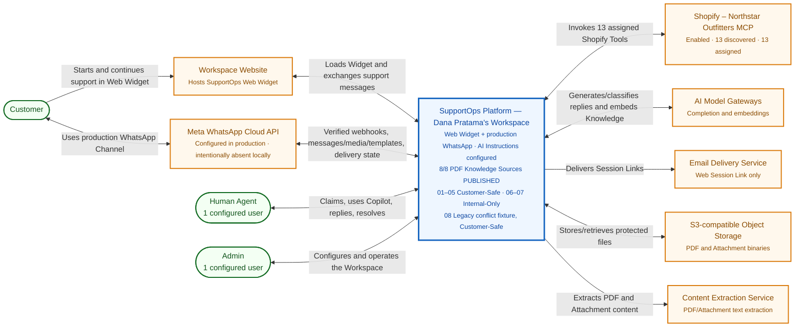

# Analisis ulang System Context Diagram SupportOps

## Ringkasan eksekutif

Diagram lama sudah menangkap gagasan utama—Customer berbicara dengan SupportOps, AI memakai model dan Tool, lalu Human Agent mengambil alih—tetapi tidak lagi menggambarkan produk yang ada di repository. Kekurangan terbesarnya bukan sekadar beberapa kotak yang hilang. Batas sistemnya juga keliru: **Web Widget digambar sebagai sistem eksternal**, padahal ia adalah aplikasi yang dimiliki, dibangun, dan dideploy sebagai bagian dari SupportOps. Sebaliknya, sistem yang benar-benar eksternal seperti **Meta WhatsApp Cloud API, layanan email, object storage, ekstraksi dokumen/web, dan backend observability** tidak terlihat.

System Context yang direkomendasikan harus tetap hanya memiliki **satu kotak SupportOps Platform**. `apps/platform`, `apps/widget`, `apps/api`, `apps/worker`, Postgres, Redis, dan package internal bukan sistem eksternal; rincian itu adalah materi Container Diagram. Di luar batas SupportOps, tampilkan tiga aktor manusia—Customer, Human Agent, Admin—serta sistem eksternal yang benar-benar berinteraksi dengan produk. Pemisahan ini konsisten dengan topologi repo: dashboard Admin dan Human Agent adalah satu aplikasi, Widget merupakan aplikasi deployable terpisah, Worker menangani proses asinkron, sementara reasoning tetap independen dari transport Channel ([`docs/adr/0001-monorepo-app-and-package-topology.md:3`](../../docs/adr/0001-monorepo-app-and-package-topology.md#L3)-[`7`](../../docs/adr/0001-monorepo-app-and-package-topology.md#L7)).

## Dasar pembacaan dan tingkat keyakinan

Analisis ini memakai sumber primer repository dengan urutan otoritas berikut:

1. source code, schema Prisma, dan deployment config untuk membuktikan interaksi yang benar-benar ada;
2. `docs/feature-tracking.md` untuk status kesiapan produk;
3. ADR accepted untuk keputusan arsitektur dan batas tanggung jawab;
4. `CONTEXT.md` untuk istilah domain.

Ada konflik internal pada feature tracking. Baris Web Widget masih mengatakan UI Human Agent belum ada, sementara bagian Platform dan alur support menyatakan `/chat`, Shared Human Queue, Claim, Takeover, dan balasan Human Agent sudah siap dicoba ([`docs/feature-tracking.md:41`](../feature-tracking.md#L41), [`50`](../feature-tracking.md#L50), [`57`](../feature-tracking.md#L57)-[`61`](../feature-tracking.md#L61)). Untuk diagram kondisi sekarang, implementasi route API serta deskripsi yang lebih baru dan lebih rinci menjadi dasar; klaim “belum ada UI Human Agent” dianggap teks usang, bukan keadaan sistem.

## Apa yang kurang atau tidak akurat pada diagram lama

### 1. Batas SupportOps salah menempatkan Web Widget

Diagram lama memberi Web Widget stereotipe `[Software System]` di luar SupportOps. Secara ownership, ini tidak tepat. Widget berada di `apps/widget`, dibangun sebagai aplikasi sendiri karena dimuat lewat satu `<script>` pada website milik Workspace, dan tetap menjadi bagian dari topologi SupportOps ([`docs/adr/0001-monorepo-app-and-package-topology.md:3`](../adr/0001-monorepo-app-and-package-topology.md#L3)-[`5`](../adr/0001-monorepo-app-and-package-topology.md#L5)). Ia bahkan sengaja tetap vanilla TypeScript dan Shadow DOM agar ringan serta terisolasi di website pihak ketiga ([`docs/adr/0013-web-widget-stays-vanilla-js.md:1`](../adr/0013-web-widget-stays-vanilla-js.md#L1)-[`9`](../adr/0013-web-widget-stays-vanilla-js.md#L9)).

Implikasinya:

- pada **System Context**, Web Widget adalah antarmuka milik SupportOps, bukan sistem eksternal;
- bila konteks hosting perlu terlihat, sistem eksternalnya adalah **Website milik Workspace**, yang memuat script Widget;
- hubungan Customer seharusnya “menggunakan SupportOps melalui Web Widget atau WhatsApp”, bukan “Customer menggunakan sistem eksternal Web Widget yang kemudian memakai SupportOps”.

Detail bahwa Widget melakukan POST untuk pesan dan menerima SSE untuk event juga terlalu rendah untuk System Context. Itu layak ditempatkan di Container Diagram. ADR menetapkan satu koneksi inbound SSE, POST untuk outbound Customer, Redis pub/sub untuk fan-out, dan database sebagai sumber pemulihan state ([`docs/adr/0005-sse-for-realtime-single-widget-channel.md:3`](../adr/0005-sse-for-realtime-single-widget-channel.md#L3)-[`15`](../adr/0005-sse-for-realtime-single-widget-channel.md#L15)).

### 2. WhatsApp sama sekali hilang

Produk sekarang memiliki dua Channel: Web Widget dan WhatsApp. Definisi domain menyatakan Channel memiliki transport, aturan Session, kemampuan Attachment, serta delivery state masing-masing; support logic tidak tinggal di Channel ([`CONTEXT.md:35`](../../CONTEXT.md#L35)-[`49`](../../CONTEXT.md#L49)). Schema juga membatasi satu konfigurasi per tipe Channel per Workspace dan menyediakan `WebWidgetConfig` serta `WhatsAppConfig` ([`apps/api/prisma/schema/channel.prisma:1`](../../apps/api/prisma/schema/channel.prisma#L1)-[`19`](../../apps/api/prisma/schema/channel.prisma#L19), [`75`](../../apps/api/prisma/schema/channel.prisma#L75)-[`114`](../../apps/api/prisma/schema/channel.prisma#L114)).

Interaksi WhatsApp bukan rencana abstrak. API memasang endpoint webhook publik `/webhooks/whatsapp` ([`apps/api/src/app.ts:37`](../../apps/api/src/app.ts#L37)-[`38`](../../apps/api/src/app.ts#L38)); webhook merutekan tenant berdasarkan `phone_number_id`, memverifikasi `X-Hub-Signature-256`, menyimpan Message, menerima delivery receipt, dan mengantrekan turn ([`apps/api/src/modules/whatsapp-config/webhook.ts:38`](../../apps/api/src/modules/whatsapp-config/webhook.ts#L38)-[`67`](../../apps/api/src/modules/whatsapp-config/webhook.ts#L67), [`107`](../../apps/api/src/modules/whatsapp-config/webhook.ts#L107)-[`134`](../../apps/api/src/modules/whatsapp-config/webhook.ts#L134)). Reasoning dan outbound delivery WhatsApp berjalan di Worker, bukan dalam request webhook ([`docs/adr/0019-whatsapp-reasoning-runs-in-the-worker.md:1`](../adr/0019-whatsapp-reasoning-runs-in-the-worker.md#L1)-[`13`](../adr/0019-whatsapp-reasoning-runs-in-the-worker.md#L13)).

Karena nomor dan Meta App dimiliki Workspace, kotak eksternal yang benar adalah **Meta WhatsApp Cloud API**, bukan “WhatsApp Channel” sebagai sistem milik SupportOps. Workspace membawa kredensial Meta sendiri; semua Workspace memakai callback yang sama dan routing dilakukan melalui Phone Number ID ([`docs/adr/0018-workspaces-bring-their-own-meta-app.md:1`](../adr/0018-workspaces-bring-their-own-meta-app.md#L1)-[`17`](../adr/0018-workspaces-bring-their-own-meta-app.md#L17)).

### 3. Peran Admin digambarkan terlalu sempit

Diagram lama hanya menyebut konfigurasi workspace, AI Agent, knowledge, tools, MCP, dan akses tim. Admin saat ini juga:

- membuat Human Agent dan Ticket Category;
- mengatur Web Widget serta menghubungkan WhatsApp;
- mengelola model instructions dan timer lifecycle;
- mengelola HTTP/Webhook Tool, MCP Server, Tool Assignment, dan Usage Instruction;
- memonitor seluruh Session/Ticket dan dashboard;
- melakukan Takeover atas Ticket AI-live;
- menugaskan atau menugaskan ulang Ticket ke Human Agent.

Hal tersebut tercatat pada halaman siap dicoba ([`docs/feature-tracking.md:30`](../feature-tracking.md#L30)-[`41`](../feature-tracking.md#L41)). Definisi domain juga menegaskan Admin dapat melihat dan bertindak atas setiap Ticket di Workspace, sedangkan Human Agent tidak ([`CONTEXT.md:13`](../../CONTEXT.md#L13)-[`19`](../../CONTEXT.md#L19)). Relasi diagram baru harus menyebut konfigurasi **dan operasi/monitoring**, bukan konfigurasi saja.

### 4. Human Agent bukan hanya “menangani escalated tickets”

Deskripsi lama benar tetapi tidak lengkap. Human Agent melihat Shared Human Queue, melakukan Claim atomik, menerima Escalation Summary saat Claim, membalas Customer, mengirim Attachment, meminta Suggested Reply dari AI Copilot, melakukan Resolution, dan memiliki unread state sendiri ([`docs/feature-tracking.md:41`](../feature-tracking.md#L41), [`58`](../feature-tracking.md#L58)-[`62`](../feature-tracking.md#L62), [`68`](../feature-tracking.md#L68)).

Perlu tetap dijaga bahwa AI Copilot bukan aktor eksternal atau sistem baru. Ia adalah mode kedua AI Agent setelah manusia memiliki Ticket; ia dapat memakai Internal-Only Knowledge, tetapi tidak boleh mengirim ke Customer ([`CONTEXT.md:219`](../../CONTEXT.md#L219)-[`225`](../../CONTEXT.md#L225)).

### 5. Customer hanya digambarkan melalui website

Customer sekarang dapat datang melalui Web Widget atau WhatsApp. Pada Web Widget, Customer melakukan Pre-Chat, memperoleh Session Link melalui email, mengirim Message/Attachment, menerima balasan AI/Human, Handoff, Follow-Up, dan penutupan. Pada WhatsApp, identitas berasal dari nomor telepon, tanpa Pre-Chat; Customer juga menerima delivery melalui thread WhatsApp ([`CONTEXT.md:47`](../../CONTEXT.md#L47)-[`77`](../../CONTEXT.md#L77)).

Customer tetap bukan user platform dan tidak pernah login ([`CONTEXT.md:25`](../../CONTEXT.md#L25)-[`30`](../../CONTEXT.md#L30)). Karena itu panah Customer ke “SupportOps Platform” perlu diberi label kanal, bukan autentikasi platform.

### 6. “AI Provider” terlalu generik dan menggabungkan tanggung jawab berbeda

Diagram lama mengatakan satu AI Provider menyediakan LLM dan embedding. Implementasi membedakan:

- **Completion gateway** untuk reply, classification, dan judge; default-nya OpenRouter tetapi endpoint dapat diganti;
- **Embedding gateway** yang tetap diarahkan ke OpenRouter karena mengganti provider/model mengharuskan re-ingest seluruh Chunk;
- **Document extraction provider** (Mistral) untuk Attachment/PDF tertentu, yang bukan reasoning provider.

Pemisahan gateway tampak langsung pada konfigurasi API ([`apps/api/src/config.ts:13`](../../apps/api/src/config.ts#L13)-[`22`](../../apps/api/src/config.ts#L22), [`146`](../../apps/api/src/config.ts#L146)-[`170`](../../apps/api/src/config.ts#L170)) dan Worker ([`apps/worker/src/config.ts:43`](../../apps/worker/src/config.ts#L43)-[`67`](../../apps/worker/src/config.ts#L67), [`89`](../../apps/worker/src/config.ts#L89)-[`104`](../../apps/worker/src/config.ts#L104)). ADR observability juga menjelaskan completion dan embedding dapat memakai gateway berbeda ([`docs/adr/0010-otlp-observability-and-manual-evals.md:27`](../adr/0010-otlp-observability-and-manual-evals.md#L27)-[`29`](../adr/0010-otlp-observability-and-manual-evals.md#L29)).

Untuk diagram yang tahan perubahan vendor, gunakan nama **AI Model Gateways** dengan keterangan completion/classification/embedding. Jangan mengunci kotak ke OpenAI atau satu vendor model. Tampilkan **Content Extraction Services** terpisah karena tujuan, data, dan failure mode-nya berbeda.

### 7. MCP Server dan External APIs digambar seolah satu rantai wajib

Diagram lama dapat dibaca sebagai SupportOps → MCP Servers → External APIs. Model sekarang lebih kaya:

- HTTP Tool memanggil external HTTP API secara langsung;
- MCP Tool dipanggil melalui remote MCP Server;
- MCP Server melakukan discovery Tool dan Admin harus meninjau/mengaktifkannya;
- kedua origin berjalan lewat satu runtime dan Tool Assignment yang sama;
- `searchKnowledge` dan `searchCustomerTicketHistory` adalah Tool intrinsik, bukan external system.

Schema membedakan `HttpToolConfig`, `McpServer`, `McpTool`, dan `ToolAssignment` ([`apps/api/prisma/schema/tool.prisma:21`](../../apps/api/prisma/schema/tool.prisma#L21)-[`80`](../../apps/api/prisma/schema/tool.prisma#L80)). Model memilih Tool yang dipanggil dari assigned Tool set serta Usage Instruction; tidak ada rule yang memaksa panggilan ([`docs/adr/0016-model-directed-tool-selection.md:5`](../adr/0016-model-directed-tool-selection.md#L5)-[`13`](../adr/0016-model-directed-tool-selection.md#L13)).

Diagram baru sebaiknya menampilkan dua kotak eksternal sejajar:

- **Workspace Business APIs** untuk HTTP Tool;
- **Remote MCP Servers** untuk discovery dan invocation MCP Tool.

Kotak generik “External APIs” dapat diganti dengan “Workspace Business Systems / APIs” agar ownership dan fungsi bisnis jelas. Repo memiliki `apps/business-system`, tetapi itu adalah **demo system**, bukan bagian produk SupportOps; endpoint-nya menyediakan customer, subscription, invoice, dan MCP demo ([`apps/business-system/src/app.ts:6`](../../apps/business-system/src/app.ts#L6)-[`69`](../../apps/business-system/src/app.ts#L69)). Pada context diagram produk, gambarkan kategori sistem bisnis milik Workspace, bukan container demo itu.

### 8. Sistem eksternal operasional tidak ditampilkan

Diagram lama menghilangkan dependensi eksternal yang sudah berada pada alur produk:

| Sistem eksternal | Relasi dengan SupportOps | Bukti |
| --- | --- | --- |
| Meta WhatsApp Cloud API | webhook inbound, media, outbound message/template, read dan delivery status | [`apps/api/src/modules/whatsapp-config/webhook.ts:38`](../../apps/api/src/modules/whatsapp-config/webhook.ts#L38)-[`58`](../../apps/api/src/modules/whatsapp-config/webhook.ts#L58), [`139`](../../apps/api/src/modules/whatsapp-config/webhook.ts#L139)-[`152`](../../apps/api/src/modules/whatsapp-config/webhook.ts#L152) |
| Email Delivery Service | mengirim Session Link Web Widget; ini bukan Email Channel | [`apps/worker/src/session-email.ts:10`](../../apps/worker/src/session-email.ts#L10)-[`36`](../../apps/worker/src/session-email.ts#L36) |
| S3-compatible Object Storage | menyimpan Attachment dan memberi signed URL | [`packages/storage/src/index.ts:27`](../../packages/storage/src/index.ts#L27)-[`54`](../../packages/storage/src/index.ts#L54), [`105`](../../packages/storage/src/index.ts#L105)-[`135`](../../packages/storage/src/index.ts#L135) |
| Content Extraction Services | ekstraksi PDF/media dan crawl URL untuk ingestion | [`apps/worker/src/config.ts:101`](../../apps/worker/src/config.ts#L101)-[`104`](../../apps/worker/src/config.ts#L104), [`apps/worker/src/knowledge-ingest.ts:61`](../../apps/worker/src/knowledge-ingest.ts#L61)-[`123`](../../apps/worker/src/knowledge-ingest.ts#L123) |
| OTLP Observability Backend | menerima telemetry AI yang sudah direduksi/redacted | [`docs/adr/0010-otlp-observability-and-manual-evals.md:1`](../adr/0010-otlp-observability-and-manual-evals.md#L1)-[`9`](../adr/0010-otlp-observability-and-manual-evals.md#L9) |

Postgres dan Redis memang hilang dari gambar, tetapi **jangan ditambahkan ke System Context**. Keduanya merupakan container internal SupportOps, terlihat di deployment sebagai `pgvector/pgvector` dan Redis, bukan sistem milik pihak lain ([`deploy/compose.prod.yaml:49`](../../deploy/compose.prod.yaml#L49)-[`78`](../../deploy/compose.prod.yaml#L78)). Demikian pula API, Worker, Platform UI, dan Widget adalah container internal ([`deploy/compose.prod.yaml:90`](../../deploy/compose.prod.yaml#L90)-[`178`](../../deploy/compose.prod.yaml#L178)). Semua itu masuk diagram level berikutnya.

### 9. Knowledge dan lifecycle penting tidak tampak pada narasi inti

Kotak SupportOps lama menyebut knowledge secara umum, tetapi tidak menunjukkan constraint yang menentukan perilaku sistem:

- hanya Knowledge Source `Published` yang retrievable;
- Customer-Safe boleh dipakai untuk jawaban otomatis;
- Internal-Only hanya untuk AI Copilot;
- bila fakta bisnis tidak grounded oleh Knowledge atau live Tool data, AI harus eskalasi;
- Session dapat ada tanpa Ticket, dan Agent Memory milik Session.

Aturan ini ada pada glossary ([`CONTEXT.md:157`](../../CONTEXT.md#L157)-[`180`](../../CONTEXT.md#L180), [`219`](../../CONTEXT.md#L219)-[`225`](../../CONTEXT.md#L225)). Diagram konteks tidak perlu memecah Knowledge Base menjadi sistem terpisah karena data itu dikelola di dalam SupportOps. Namun deskripsi pusat harus menyebut “grounded AI support, knowledge, tools, ticket lifecycle, and human handoff” agar fungsi inti tidak direduksi menjadi sekadar chat routing.

Session juga lebih fundamental daripada gambar lama: ia adalah percakapan kontinu per Customer per Channel, dapat menghasilkan paling banyak satu Ticket, dan membawa Agent Memory sejak sebelum Ticket dibuat ([`CONTEXT.md:51`](../../CONTEXT.md#L51)-[`57`](../../CONTEXT.md#L57), [`docs/adr/0017-agent-memory-belongs-to-the-session.md:1`](../adr/0017-agent-memory-belongs-to-the-session.md#L1)-[`19`](../adr/0017-agent-memory-belongs-to-the-session.md#L19)). Ini sebaiknya dijelaskan dalam dokumentasi pendamping, bukan dijadikan kotak di System Context.

### 10. Keamanan dan multi-tenancy tidak terlihat

SupportOps adalah platform multi-tenant: seluruh data terikat tepat ke satu Workspace ([`CONTEXT.md:9`](../../CONTEXT.md#L9)-[`14`](../../CONTEXT.md#L14)). Query scoped difilter melalui Prisma extension dari request context; pendekatan ini dipilih untuk mencegah kebocoran lintas Workspace akibat filter yang terlupa ([`docs/adr/0008-workspace-isolation-via-prisma-extension.md:1`](../adr/0008-workspace-isolation-via-prisma-extension.md#L1)-[`11`](../adr/0008-workspace-isolation-via-prisma-extension.md#L11)).

Customer Web Widget tidak memakai akun pengguna. Request diautentikasi melalui access token Session dan origin divalidasi terhadap allowed domain Workspace ([`docs/adr/0011-widget-requests-authenticate-by-session-token.md:1`](../adr/0011-widget-requests-authenticate-by-session-token.md#L1)-[`13`](../adr/0011-widget-requests-authenticate-by-session-token.md#L13)). Admin dan Human Agent memakai authenticated Platform. Diagram konteks tidak perlu menggambar Better Auth sebagai sistem eksternal karena autentikasi dijalankan di API yang sama (`/api/auth/*`) ([`apps/api/src/app.ts:48`](../../apps/api/src/app.ts#L48)-[`65`](../../apps/api/src/app.ts#L65)); cukup label hubungan aktor yang membedakan signed-in Workspace user dari Session-token Customer.

## Implemented versus planned/partial

Status berikut sengaja memisahkan “ada di desain” dari “dapat dipakai sekarang”.

### Terimplementasi / siap dicoba

- akun Workspace, login/logout, role-based navigation, Admin dan Human Agent pada satu Platform UI;
- konfigurasi satu Web Widget per Workspace, Pre-Chat, Session Link melalui email, Customer Message/Attachment, AI reply via SSE, Session dan Ticket;
- Shared Human Queue, Claim, Handoff, Escalation Summary, human reply, Takeover, Suggested Reply, dan human/AI Resolution;
- Follow-Up, Auto-Resolution, Idle Closure, Activity Timeline, unread state, dan analytics/dashboard;
- Knowledge Source dari text/PDF/website dengan ingestion asinkron, visibility, embedding, pgvector retrieval, dan auto-publish;
- HTTP Tool dan MCP Tool melalui Tool Assignment, discovery/review MCP, server-side authorization, risk, dan AI Activity;
- Attachment Web Widget, object storage, ekstraksi, dan signed access;
- AI telemetry ke console/OTLP serta eval manual.

Dasar status utamanya adalah matriks halaman dan alur produk ([`docs/feature-tracking.md:28`](../feature-tracking.md#L28)-[`42`](../feature-tracking.md#L42), [`44`](../feature-tracking.md#L44)-[`70`](../feature-tracking.md#L70)). Worker yang benar-benar menjalankan email, ingestion, Attachment, timer, Ticket Knowledge, dan WhatsApp juga terdaftar eksplisit di source ([`apps/worker/src/index.ts:62`](../../apps/worker/src/index.ts#L62)-[`124`](../../apps/worker/src/index.ts#L124)).

### Sebagian siap

- **WhatsApp Channel**: teks, Attachment, webhook, idempotency/debounce, AI, queue manusia, delivery state, lifecycle, Customer Service Window, dan Message Template sudah ada; status keseluruhan masih “Sebagian siap”, terutama karena bergantung pada Meta App/kredensial/template milik Workspace dan readiness eksternal ([`docs/feature-tracking.md:71`](../feature-tracking.md#L71)). Karena alur utamanya sudah nyata, ia tetap harus tampil pada diagram, diberi anotasi “partial/operational prerequisites”.
- **Business Tool context binding**: runtime belum meneruskan Customer Identity ke input Tool demo, sehingga demo memakai customer tetap. Ini batasan implementasi, bukan alasan menghilangkan Business Systems dari context diagram ([`docs/feature-tracking.md:67`](../feature-tracking.md#L67), [`apps/business-system/src/app.ts:9`](../../apps/business-system/src/app.ts#L9)-[`16`](../../apps/business-system/src/app.ts#L16)).

### Belum tersedia atau jangan diklaim

- **Email sebagai Channel support** belum tersedia. Email hanya dipakai untuk mengirim Session Link; jangan menggambar Customer mengirim support email ke SupportOps ([`docs/feature-tracking.md:71`](../feature-tracking.md#L71), [`apps/worker/src/session-email.ts:10`](../../apps/worker/src/session-email.ts#L10)-[`36`](../../apps/worker/src/session-email.ts#L36)).
- Jangan menggambar WebSocket; realtime memakai SSE dan Redis pub/sub ([`docs/adr/0005-sse-for-realtime-single-widget-channel.md:3`](../adr/0005-sse-for-realtime-single-widget-channel.md#L3)-[`7`](../adr/0005-sse-for-realtime-single-widget-channel.md#L7)).
- Jangan menggambar Qdrant; vector storage berada di Postgres/pgvector ([`docs/adr/0003-pgvector-over-qdrant.md:1`](../adr/0003-pgvector-over-qdrant.md#L1)-[`10`](../adr/0003-pgvector-over-qdrant.md#L10)).
- Jangan menggambar Cloudflare Workers sebagai hosting aplikasi; produk dideploy sebagai container ke VPS. R2/S3-compatible object storage adalah pengecualian eksternal ([`docs/adr/0007-vps-containers-over-cloudflare.md:1`](../adr/0007-vps-containers-over-cloudflare.md#L1)-[`7`](../adr/0007-vps-containers-over-cloudflare.md#L7)).
- Jangan mengklaim replay event SSE satu per satu. Saat ini reconnect me-refetch state database terbaru ([`docs/feature-tracking.md:41`](../feature-tracking.md#L41)).

## Scope C4 System Context yang direkomendasikan

### System of interest

**SupportOps Platform** — platform customer support multi-tenant, AI-first, yang menerima percakapan dari Web Widget dan WhatsApp, membuat Session/Ticket, memberi jawaban grounded dari Knowledge dan Tool, mengelola lifecycle/escalation/handoff, menyediakan workspace operasional untuk manusia, dan menyimpan audit produk.

Deskripsi sengaja tidak menyebut API, Worker, database, queue, SSE, atau framework. Itu detail container/technology.

### Aktor manusia

| Aktor | Scope hubungan yang tepat |
| --- | --- |
| Customer | Memulai dan melanjutkan support melalui Web Widget atau nomor WhatsApp Workspace; mengirim Message/Attachment dan menerima respons AI/Human serta lifecycle notification. Tidak login ke Platform. |
| Human Agent | Login ke Platform; melihat Shared Human Queue/My Tickets, Claim, membaca transcript dan Attachment, memakai AI Copilot atas permintaan, membalas, dan melakukan Resolution. |
| Admin | Login ke Platform; seluruh kemampuan Human Agent ditambah konfigurasi Workspace/users/categories/Channels/AI/Knowledge/Tools, monitoring semua Session/Ticket, assignment, Takeover, dan analytics. |

Tidak perlu menambah “Developer/Operator” pada diagram produk utama. Mereka relevan untuk Deployment/Operational Context karena mengonsumsi telemetry dan menjalankan eval, bukan use case customer-support harian.

### Sistem eksternal

| Sistem | Masuk diagram utama? | Alasan dan hubungan |
| --- | --- | --- |
| Website milik Workspace | Ya, bila konteks embed penting | Memuat script Web Widget milik SupportOps. Dapat dihilangkan pada versi ringkas dan disebut dalam label Customer. |
| Meta WhatsApp Cloud API | Ya | Membawa Message/media/webhook dan outbound Message/template/delivery status. |
| AI Model Gateways | Ya | Completion, classification, embeddings, dan eval judge; provider endpoint dapat berbeda. |
| Workspace Business Systems / APIs | Ya | Menyediakan live customer/subscription/invoice data atau actions melalui HTTP Tools. |
| Remote MCP Servers | Ya | Discovery dan invocation MCP Tools yang direview/diaktifkan Admin. |
| Email Delivery Service | Ya | Mengirim Session Link Web Widget. Label harus menegaskan bukan support Channel. |
| S3-compatible Object Storage | Ya | Menyimpan Attachment/source binary dan melayani signed access. |
| Content Extraction Services | Ya pada versi lengkap | Mengekstrak PDF/media dan crawl website untuk Knowledge/Attachment processing. |
| OTLP Observability Backend | Opsional pada versi produk; ya pada versi arsitektur lengkap | Menerima telemetry developer-facing, bukan audit trail produk. |

### Yang harus tetap di dalam satu boundary SupportOps

- Platform UI untuk Admin/Human Agent;
- Web Widget yang didistribusikan SupportOps;
- API dan webhook handlers;
- AI Agent runtime dan AI Copilot mode;
- Channel Adapters;
- Worker/BullMQ processing;
- Postgres/pgvector dan Redis;
- Knowledge Base, Ticket/Session/Message store, AI Activity, auth, analytics.

Jika item-item ini perlu divisualkan sebagai kotak terpisah, buat **C4 Container Diagram** kedua. Memasukkannya sebagai peer sistem eksternal pada System Context akan mengaburkan ownership dan trust boundary.

## Draft diagram C4-like (Mermaid)

Draft ini sengaja mempertahankan satu system-of-interest dan memberi status partial pada WhatsApp. Mermaid standar dipilih agar dapat dirender tanpa plugin C4 khusus.

## Overlay: konfigurasi Workspace saat analisis

Bagian ini **bukan arsitektur produk universal**. Ini adalah instansiasi diagram untuk Workspace yang sama pada dua environment: database development dapat diperiksa langsung, sedangkan status production WhatsApp berasal dari konfirmasi pemilik Workspace. Token, secret header, URL MCP privat, dan kredensial tidak dibaca atau dicantumkan.

### State runtime yang terverifikasi

| Area | State Workspace lokal |
| --- | --- |
| Workspace | `Dana Pratama's Workspace` |
| Pengguna | 1 Admin dan 1 Human Agent |
| Channel development | Web Widget berstatus `ACTIVE`; WhatsApp sengaja tidak dikonfigurasi secara lokal |
| Channel production | Web Widget dan WhatsApp digunakan; keberadaan WhatsApp dikonfirmasi oleh pemilik Workspace, tetapi database production tidak diakses dalam analisis ini |
| AI configuration | AI Agent Instructions, Handoff Message, dan Resolution Message telah diisi. Instructions mengarahkan penggunaan Shopify untuk data commerce live, Knowledge untuk policy/guidance, penggunaan keduanya untuk pertanyaan hybrid, approval untuk operasi mutating, Escalation saat konflik/kegagalan/risiko, dan larangan membocorkan Internal-Only; teks lengkap tidak direproduksi |
| Knowledge | Delapan PDF `docs/knowledge/01_...` sampai `08_...`, semuanya `PUBLISHED` |
| Visibility | PDF 01–05 `CUSTOMER_SAFE`; PDF 06–07 `INTERNAL_ONLY`; PDF 08 `CUSTOMER_SAFE` |
| MCP | `Shopify - Northstar Outfitters` enabled; 13 Tool ditemukan dan seluruh 13 Tool di-assign ke AI Agent |

Daftar dan peran corpus Northstar didokumentasikan pada [`docs/testing/ai-agent-eval-cases.md:22`](../testing/ai-agent-eval-cases.md#L22)-[`30`](../testing/ai-agent-eval-cases.md#L30) serta file [`docs/knowledge/01_Shopping_and_Product_Discovery_Guide.pdf`](../knowledge/01_Shopping_and_Product_Discovery_Guide.pdf) sampai [`docs/knowledge/08_LEGACY_Returns_and_Exchanges_Policy.pdf`](../knowledge/08_LEGACY_Returns_and_Exchanges_Policy.pdf). `docs/knowledge/README.md` masih mendeskripsikan corpus NusaWorkspace lama dan merupakan documentation drift; jangan memakainya sebagai sumber diagram Northstar. Mekanisme aplikasi memang menyimpan instructions per `AiAgent` dan mengubahnya bersama lifecycle messages ([`apps/api/src/modules/ai-settings/services.ts:21`](../../apps/api/src/modules/ai-settings/services.ts#L21)-[`48`](../../apps/api/src/modules/ai-settings/services.ts#L48)); UI mensyaratkan instructions tidak kosong ([`apps/platform/src/features/settings/views/ai/ai.utils.ts:1`](../../apps/platform/src/features/settings/views/ai/ai.utils.ts#L1)-[`4`](../../apps/platform/src/features/settings/views/ai/ai.utils.ts#L4)).

PDF 08 bernama `LEGACY_Returns_and_Exchanges_Policy` tetapi tetap `CUSTOMER_SAFE` dan `PUBLISHED`. Ini tampak sebagai conflict/negative-retrieval fixture yang disengaja, bukan sumber yang boleh dihapus dari diagram. Implikasi diagramnya adalah label Knowledge harus menyebut **published corpus dengan Visibility**, sedangkan dokumentasi pendamping harus menjelaskan bahwa precedence/currentness diselesaikan oleh retrieval dan instructions, bukan dari nama file saja. Repo juga mencatat bahwa judul Source ikut diberikan pada hasil `searchKnowledge` agar model dapat mengenali Source legacy/superseded yang bertentangan ([`docs/ai-agent-performance-tracking.md:161`](../ai-agent-performance-tracking.md#L161)).

### Bedakan runtime saat ini dari kapabilitas produk

- **Shopify MCP adalah konfigurasi runtime terverifikasi**, sehingga untuk gambar demo/Workspace-specific kotak generik “Remote MCP Servers” sebaiknya diberi nama **Shopify – Northstar Outfitters MCP** dan relasinya “13 assigned Tools for catalog, order, cart, and checkout operations”.
- **Delapan PDF adalah corpus runtime terverifikasi**, tetapi tetap berada di dalam boundary SupportOps sebagai Knowledge Source; jangan menggambar setiap PDF sebagai external system.
- **AI Agent Instructions terkonfigurasi** adalah state internal, bukan aktor/sistem eksternal. Tampilkan sebagai anotasi pada SupportOps/AI Agent, tanpa menyalin isinya.
- **WhatsApp adalah Channel production untuk Workspace ini.** Tetap gambar Meta WhatsApp Cloud API sebagai hubungan aktif, dengan catatan “configured in production; intentionally absent in local development”. Ini membedakan deployment state dari kapabilitas produk tanpa menyimpulkan bahwa WhatsApp belum dipakai.
- **Business System Demo bukan MCP aktif Workspace ini.** State lokal menunjukkan Shopify sebagai MCP aktif/assigned; diagram demo tidak boleh menyiratkan `apps/business-system` sedang menangani Tool calls Workspace ini.

### Draft diagram Workspace-specific

Pada versi Workspace-specific ini Meta WhatsApp digambar aktif karena dikonfigurasi di production; anotasi environment menjelaskan mengapa ia tidak muncul di database development. Generic Business APIs tetap tidak digambar karena Shopify MCP—bukan `apps/business-system` demo—adalah integrasi commerce aktif Workspace ini.

## Relasi yang sebaiknya tertulis eksplisit pada gambar final

Gunakan label yang menyatakan tujuan bisnis, bukan protokol semata:

- Customer → SupportOps: “Starts and continues support conversations through Web Widget”.
- Customer ↔ Meta ↔ SupportOps: “Exchanges WhatsApp messages, media, templates, and delivery states”.
- Human Agent ↔ SupportOps: “Claims escalated Tickets, receives AI assistance, replies, and resolves”.
- Admin ↔ SupportOps: “Configures and operates Workspace; monitors and takes over support”.
- SupportOps ↔ AI Model Gateways: “Generates/classifies responses and embeds searchable Knowledge”.
- SupportOps ↔ Business Systems/APIs: “Retrieves live facts and performs approved actions through assigned HTTP Tools”.
- SupportOps ↔ MCP Servers: “Discovers reviewed Tools and invokes enabled assigned Tools”.
- SupportOps → Email Service: “Delivers Web Session Links”.
- SupportOps ↔ Object Storage: “Stores and serves protected Attachments/source files”.
- SupportOps → Extraction Services: “Extracts/crawls content for Knowledge and Attachment context”.
- SupportOps → OTLP Backend: “Exports redacted AI telemetry; not product audit data”.

Protocol seperti HTTPS, SSE, webhook, OTLP, S3, atau Streamable HTTP boleh dicantumkan sebagai catatan sekunder. Menjadikannya label utama, seperti “via HTTPS” pada gambar lama, menjelaskan mekanisme tetapi tidak menjelaskan alasan hubungan.

## Rekomendasi struktur artefak akhir

Satu gambar tidak sebaiknya memikul seluruh arsitektur. Gunakan dua artefak:

1. **System Context Diagram** di atas untuk audience produk, keamanan, dan stakeholder: ownership, aktor, external systems, dan tujuan hubungan.
2. **Container Diagram SupportOps** terpisah untuk implementer: Platform UI, Widget, API, Worker, Business System demo (dengan penanda demo/external stand-in), Postgres/pgvector, Redis, object storage, serta alur SSE/webhook/job.

Dengan pemisahan itu, diagram konteks tetap stabil ketika implementasi internal berubah, sementara detail seperti Web Widget terpisah, WhatsApp reasoning di Worker, dan pgvector tetap terdokumentasi pada level yang tepat.
